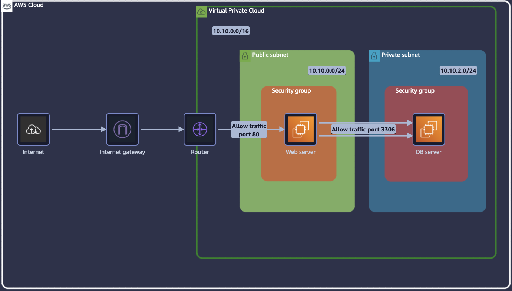
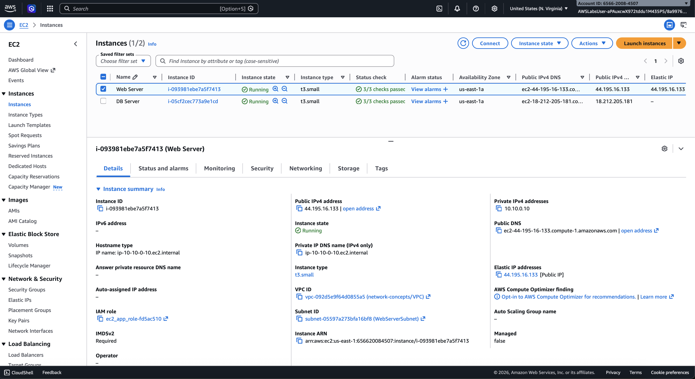
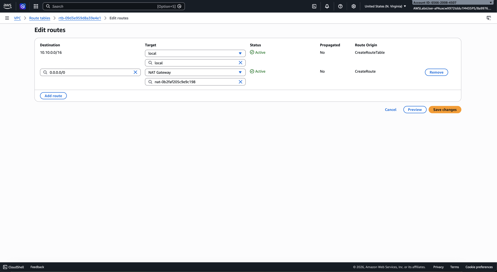
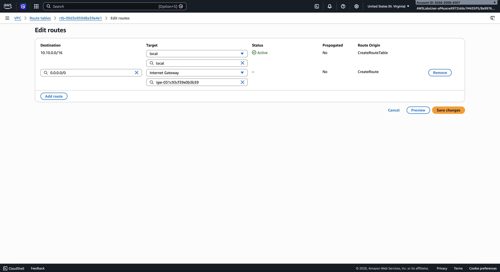
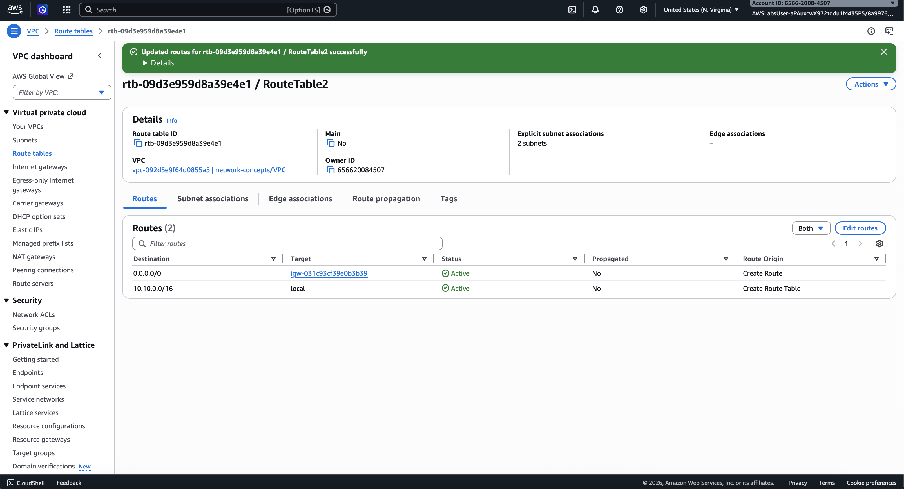
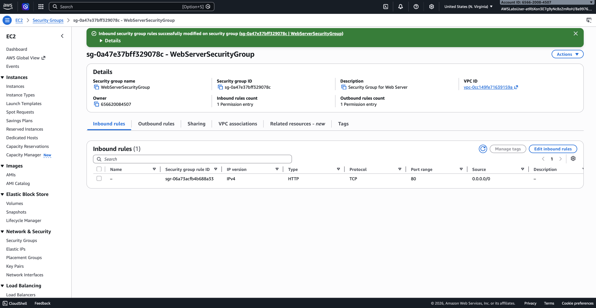
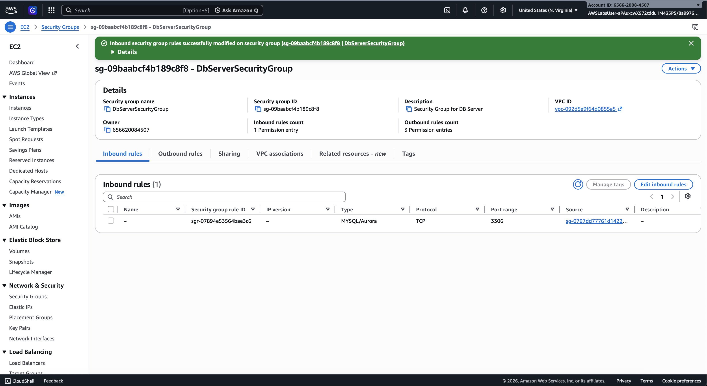

# Lab: VPC Network Architecture — Securing Bank Internal Resources

**Date:** 06/05/2026  
**Environment:** AWS SimuLearn (ephemeral lab)  
**Scenario:** A bank needs a network architecture that securely controls 
communication between its internal resources and the internet.

---

## Problem Statement

The web server was not accessible from the internet. Upon diagnosis, the 
root cause was that the public subnet's route table was pointing to a 
NAT Gateway instead of an Internet Gateway.

**NAT Gateway** — allows resources inside a private subnet to initiate 
outbound traffic to the internet. It does NOT allow inbound traffic from 
the internet. This is correct for a database server, wrong for a public 
web server.

**Internet Gateway** — allows two-way communication between resources 
in a public subnet and the internet. This is what a web server needs.

---

## Architecture Diagram

---

## What I Did (Step by Step)

### 1. Diagnosed the Issue
Opened the VPC console and inspected the route table attached to the 
public subnet. Found that the default route (0.0.0.0/0) was pointing 
to a NAT Gateway — not an Internet Gateway. This explained why the 
web server was unreachable from outside.

### 2. Removed the NAT Gateway from the Public Subnet Route Table
Edited the public subnet route table and deleted the NAT Gateway route. 

### 3. Created and Attached an Internet Gateway
Created a new Internet Gateway and attached it to the VPC.

### 4. Updated the Public Subnet Route Table
Added a new route to the public subnet route table:
- Destination: `0.0.0.0/0`
- Target: the Internet Gateway

This allows the web server to receive inbound traffic from the internet.

### 5. Updated the Web Server Security Group (Inbound Rules)
Added an inbound rule to the web server security group:
- Type: HTTP
- Port: 80
- Source: `0.0.0.0/0`

This allows any browser on the internet to reach the web server on port 80.

### 6. Connected the Web Server and Database Using Security Group to Security Group Communication
Instead of opening the database to all traffic (which would be a security 
risk), I configured the database server's security group to only accept 
inbound traffic from the web server's security group ID.

This means only the web server can talk to the database, nothing else 
can reach it, not even other resources inside the same VPC.

---

## Screenshots

---

## Security Observations

- **Never put a database in a public subnet.** The database sits in a 
  private subnet with no route to the internet — it can only be reached 
  by the web server through security group rules
- **Security group to security group communication is the correct pattern** 
  for internal service communication. Using `0.0.0.0/0` as the source for 
  the database inbound rule would expose it to the entire internet
- **Port 80 (HTTP) has no encryption.** In production, the web server 
  should serve traffic on port 443 (HTTPS) with a TLS certificate from 
  AWS Certificate Manager, and port 80 should redirect to 443
- **NAT Gateway belongs in private subnets only** — it allows private 
  resources like the database to pull software updates outbound without 
  being reachable inbound

  ---

## What I Would Do Differently in Production

1. Add HTTPS (port 443) to the web server security group and install a 
   TLS certificate — never serve a bank website over plain HTTP
2. Place an Application Load Balancer in front of the web server so the 
   EC2 instance itself never receives direct internet traffic
3. Add a WAF (Web Application Firewall) to the load balancer to filter 
   malicious requests before they reach the web server
4. Enable VPC Flow Logs to capture all network traffic for security 
   monitoring and incident response
5. Keep the NAT Gateway attached to the private subnet so the database 
   can still reach the internet for updates — but remove it from the 
   public subnet entirely
