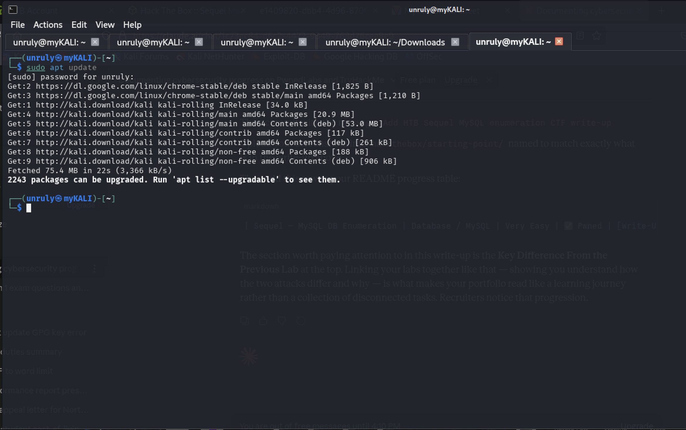
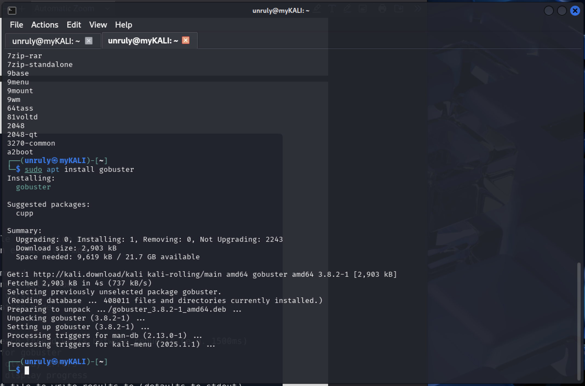
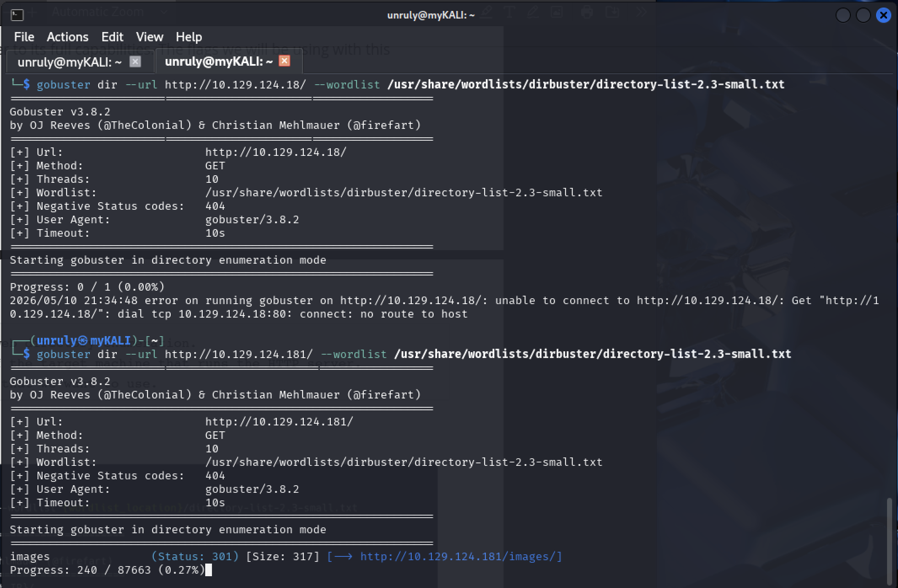
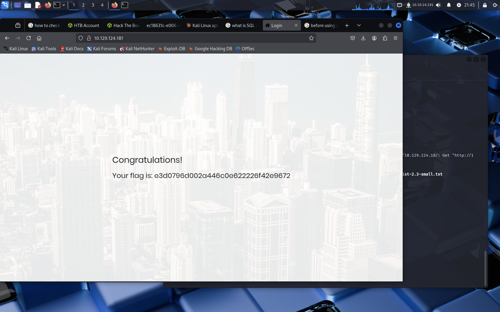

# HTB CTF Write-Up: Appointment — SQL Injection

**Date:** 11/05/2026
**Platform:** HackTheBox Starting Point
**Machine:** Appointment
**Difficulty:** Very Easy (Tier 1)
**Category:** Web Application, SQL Injection
**Status:** ✅ Pwned — Flag Captured

---

## Objective

Exploit a SQL Injection vulnerability in a login form to bypass 
authentication and retrieve the flag — without knowing any valid credentials.

---

## Tools Used

- Kali Linux (local machine via OpenVPN)
- Nmap — port scanning and service enumeration
- Gobuster — web directory brute-forcing
- Browser — manual SQL injection
- SecLists / pre-installed wordlists — directory enumeration wordlist

---

## My Methodology

### Phase 1 — Enumeration with Nmap

First I scanned the target to identify open ports and running services.

```bash
sudo nmap -sC -sV -p80 10.129.124.181
```

**Result:** Only port 80 was open, running Apache httpd 2.4.38 on Debian.
This told me immediately the attack surface was web-based.

**Why -sC and -sV require sudo:** These flags perform script scanning 
and version detection, which are more intrusive. They require root 
privileges to send the necessary raw packets.

---

### Phase 2 — Web Directory Enumeration with Gobuster

Navigating to the target IP in the browser showed a login form with no 
obvious links or pages. I used Gobuster to check for hidden directories.

**First I installed Gobuster:**

```bash
sudo apt update
sudo apt install gobuster
```

**Then ran the directory scan:**

```bash
gobuster dir --url http://http://10.129.124.181/ --wordlist 
/usr/share/wordlists/dirbuster/directory-list-2.3-small.txt
```

**Result:** Gobuster found only standard default directories — /images, 
/css, /js, /vendor, /fonts — all returning 301 redirects. Nothing 
exploitable or unusual. This is still a valuable step because in real 
engagements, misconfigured directories sometimes expose admin panels, 
backup files, or configuration files left there by mistake.

---

### Phase 3 — Testing Default Credentials

Since Gobuster found nothing useful, I tested common default credential 
combinations on the login form manually:

- admin:admin
- guest:guest
- user:user
- root:root
- administrator:password

None of these worked. Rather than brute-forcing (which is slow and noisy 
— easily detected by a WAF or IDS), I moved to the next logical step.

---

### Phase 4 — SQL Injection via Login Form

The login form sends user input directly into a SQL query without 
sanitisation. The backend PHP code constructs the query like this:

```sql
SELECT * FROM users WHERE username='$username' AND password='$password'
```

Because there is no input validation, I can inject SQL syntax directly 
through the username field to manipulate the query.

**The payload I used:**
Username: admin'#
Password: anything

**What this does to the SQL query:**

```sql
SELECT * FROM users WHERE username='admin'#' AND password='anything'
```

The single quote `'` closes the username string early. The hashtag `#` 
comments out everything that follows — including the entire password 
check. The database only checks if a user called `admin` exists, 
which it does. Authentication is bypassed without knowing the password.

---

### Phase 5 — Flag Retrieved

After submitting the SQL injection payload, the application logged me 
in as admin and presented the flag on the success page.

**Flag captured. Machine pwned.**

---

## Screenshots







---

## Why This Attack Worked

The application failed on three levels:

1. **No input validation** — special characters like `'` and `#` were 
   accepted in the username field without being sanitised or escaped
2. **No parameterized queries** — the SQL query was built by 
   concatenating raw user input directly into the query string
3. **No WAF or rate limiting** — there was nothing to block or slow 
   repeated login attempts or detect injection characters

---

## How to Fix This Vulnerability

| Fix | How It Works |
|---|---|
| Parameterized queries | User input is treated as data, never as SQL code — the query structure is fixed before input is inserted |
| Input validation | Reject or escape special characters like `'`, `#`, `--`, `;` before they reach the database |
| Stored procedures | Predefined SQL logic that prevents user input from altering the query structure |
| WAF (Web Application Firewall) | Detects and blocks SQL injection patterns before they reach the application |
| Least privilege DB user | The database user the app connects as should have only SELECT permission — not DROP, UPDATE, or admin rights |

---

## What I Learned

- **Enumeration always comes first** — even if Gobuster finds nothing, 
  you eliminate attack surfaces systematically rather than guessing
- **SQL Injection on a login form does not require knowing any 
  credentials** — you only need a valid username and a way to 
  comment out the password check
- **The `#` character in MySQL comments out the rest of a query** — 
  `--` serves the same purpose in other SQL dialects (MSSQL, PostgreSQL)
- **Default credentials should always be tested** before moving to 
  more complex exploits — sometimes the simplest path works
- **Gobuster returning only standard directories is useful information** 
  — it tells you the attack surface is the application itself, 
  not a misconfigured server
