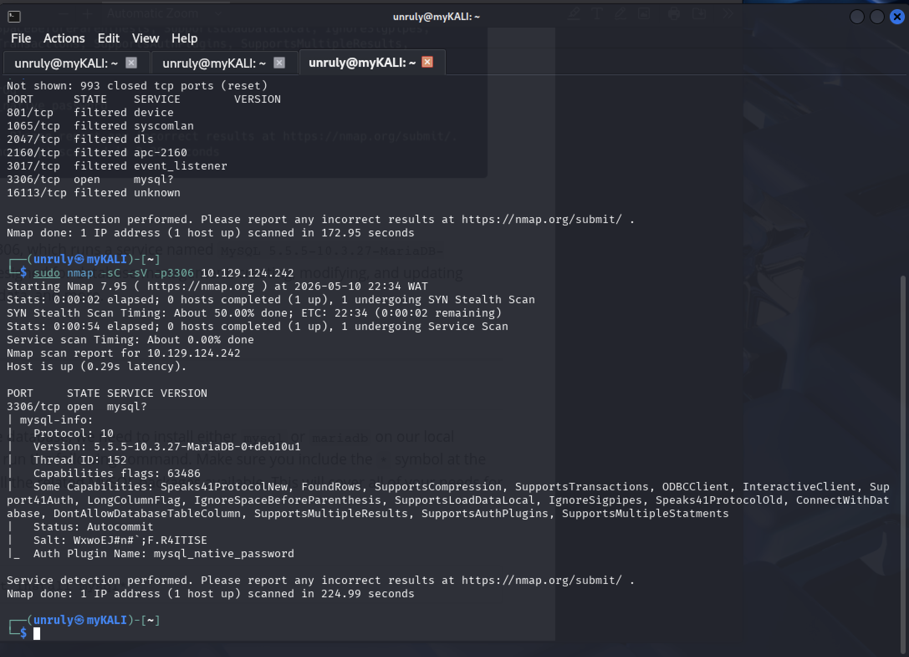
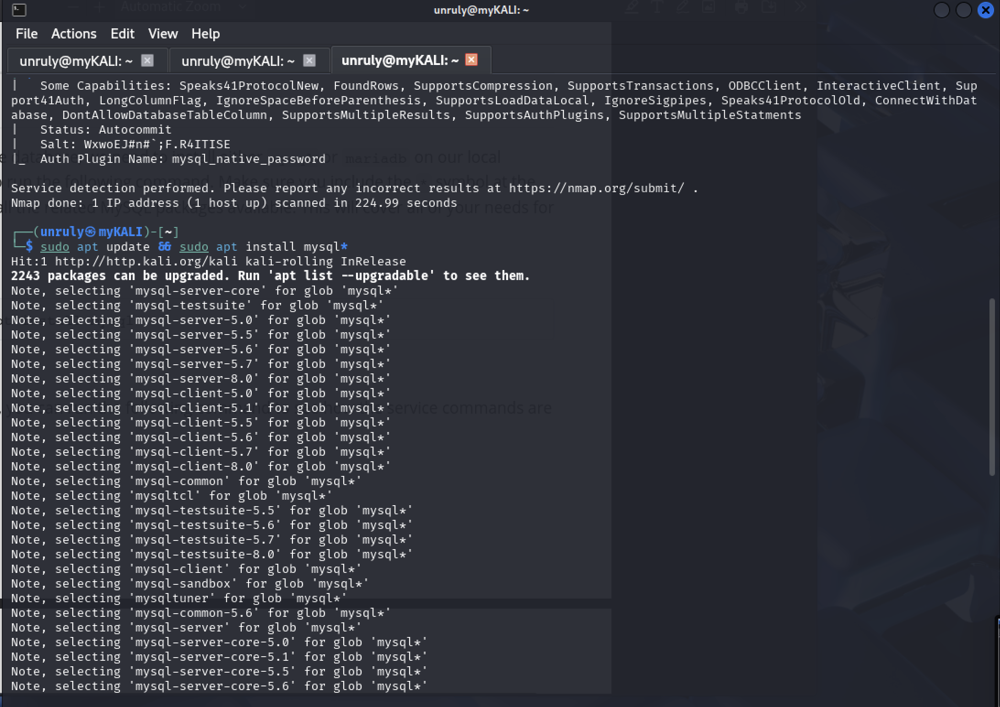
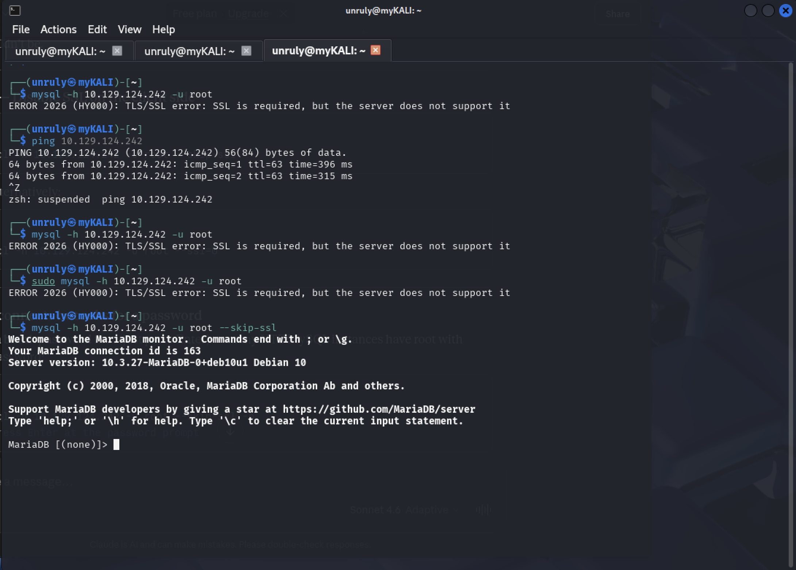
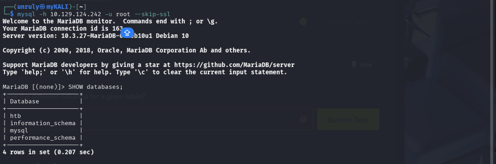
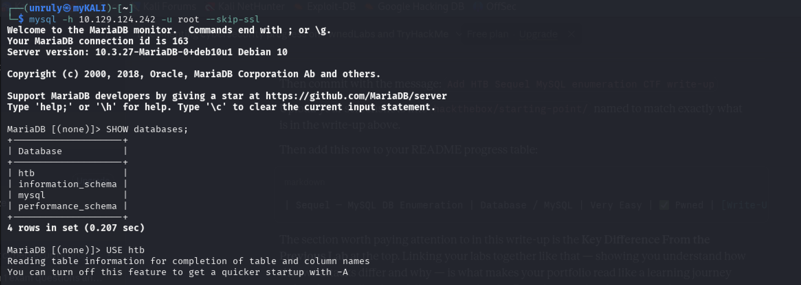
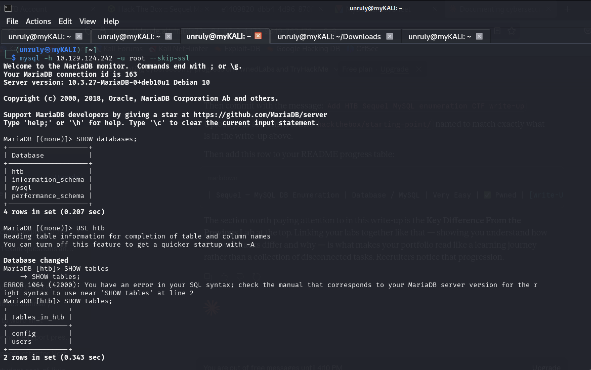
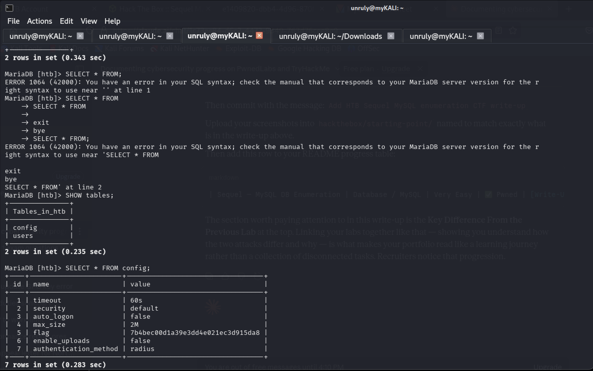

# HTB CTF Write-Up: Sequel — MySQL Database Enumeration

**Date:** 11/05/2026

**Platform:** HackTheBox Starting Point

**Machine:** Sequel

**Category:** Database Enumeration, MySQL, MariaDB

**Status:** ✅ Pwned — Flag Captured

---

## Objective

Connect directly to an exposed MySQL/MariaDB service, enumerate its 
databases and tables using SQL queries, and extract the flag stored 
inside the database — without going through a web application at all.

---

## Tools Used

- Kali Linux (local machine via OpenVPN)
- Nmap — port scanning and service version detection
- MySQL client — direct database connection and enumeration

---

## My Methodology

### Phase 1 — Enumeration with Nmap

```bash
sudo nmap -sC -sV 10.129.124.242
```

**Result:** Only one open port found — port 3306 running 
MySQL 5.5.5-10.3.27-MariaDB-0+deb10u1.

Port 3306 is the default MySQL/MariaDB port. Finding it open and 
directly reachable from the internet is a significant misconfiguration. 
In a properly secured environment, this port should never be exposed 
publicly — database access should only be allowed from the application 
server's IP, enforced by a firewall rule.

---

### Phase 2 — Installing the MySQL Client

To talk directly to a MySQL/MariaDB service from Kali, I needed 
the MySQL client tools installed locally.

```bash
sudo apt update && sudo apt install mysql* -y
```

The `*` wildcard installs all related MySQL packages — client, 
libraries, and utilities — in one command.

---

### Phase 3 — Connecting as Root With No Password

Before trying complex attacks, I tested the most common 
misconfiguration first: passwordless root access.

```bash
mysql -h 10.129.124.242 -u root --skip-ssl
```

**Result:** Connection accepted. No password was required.

The `-h` flag specifies the remote host to connect to. The `-u` flag 
specifies the username. The absence of `-p` means no password was 
supplied — and the server accepted it anyway.

This is a critical misconfiguration. The root database user had no 
password set, and the service was exposed on a public-facing port. 
Any attacker who found port 3306 open could walk straight in.

---

### Phase 4 — Enumerating Databases

Once inside the MariaDB shell, I listed all available databases:

```sql
SHOW databases;
```

**Result:** Four databases returned — `htb`, `information_schema`, 
`mysql`, `performance_schema`.

The `htb` database stood out immediately as non-standard. The others 
are default system databases that exist in every MySQL installation.

---

### Phase 5 — Selecting the Target Database

```sql
USE htb;
```

This sets `htb` as the active database for all subsequent queries. 
The prompt changed from `MariaDB [(none)]>` to `MariaDB [htb]>` 
confirming the switch.

---

### Phase 6 — Enumerating Tables

```sql
SHOW tables;
```

**Result:** Two tables found — `config` and `users`.

`config` is the more interesting target. Configuration tables in 
real applications often store credentials, API keys, secrets, and 
settings that should never be accessible to an attacker.

---

### Phase 7 — Dumping the Config Table

```sql
SELECT * FROM config;
```

**Result:** The table returned 7 rows including a row with the 
name `flag` containing its value.

**Flag captured. Machine pwned.**

---

## Screenshots









---

## MySQL Commands Used — Quick Reference

| Command | What It Does |
|---|---|
| `SHOW databases;` | Lists all databases the current user can access |
| `USE {database};` | Switches to the specified database |
| `SHOW tables;` | Lists all tables in the currently active database |
| `SELECT * FROM {table};` | Returns all rows and columns from the specified table |

Every MySQL command must end with a semicolon `;` — 
this tells the MySQL shell the query is complete and ready to execute.

---

## Why This Attack Worked

Three misconfigurations made this possible:

1. **Port 3306 exposed to the internet** — the database port should 
   be firewalled to only accept connections from the application 
   server's private IP address, never from the public internet
2. **Root account had no password** — the most privileged database 
   user was left with no authentication requirement
3. **Sensitive data stored in plaintext** — the flag (and by 
   extension, real secrets like API keys or credentials) was stored 
   in the database in plain readable text with no encryption

Any one of these fixes alone would have prevented this attack. 
All three together make the system completely open.

---

## How to Fix This

| Fix | How It Works |
|---|---|
| Firewall port 3306 | Allow inbound connections on 3306 only from the app server's private IP — block all other sources |
| Set a strong root password | `ALTER USER 'root'@'localhost' IDENTIFIED BY 'strong_password';` |
| Remove anonymous and remote root accounts | Root should only be accessible from localhost, never from a remote IP |
| Use a least-privilege app user | The web application should connect with a dedicated DB user that has only SELECT/INSERT on specific tables — never root |
| Encrypt sensitive values | Secrets and credentials stored in config tables should be encrypted at rest, not stored in plaintext |

---

## What I Learned

- **Always test for passwordless authentication first** — it is 
  surprisingly common in dev environments that get promoted to 
  production without being hardened
- **Port 3306 open on an internet-facing machine is a critical 
  finding** — in a real penetration test this would be a 
  Critical/P1 severity finding reported immediately
- **Database enumeration follows a logical sequence** — databases 
  → tables → columns → data. Every MySQL engagement follows 
  this same pattern
- **`SHOW databases` reveals the full picture** — system databases 
  like `information_schema` and `mysql` are default; anything 
  else is application data worth investigating
- **Direct database access is more dangerous than web SQLi** — 
  in the previous lab I could only manipulate one query. Here 
  I had full read access to every table in every database
