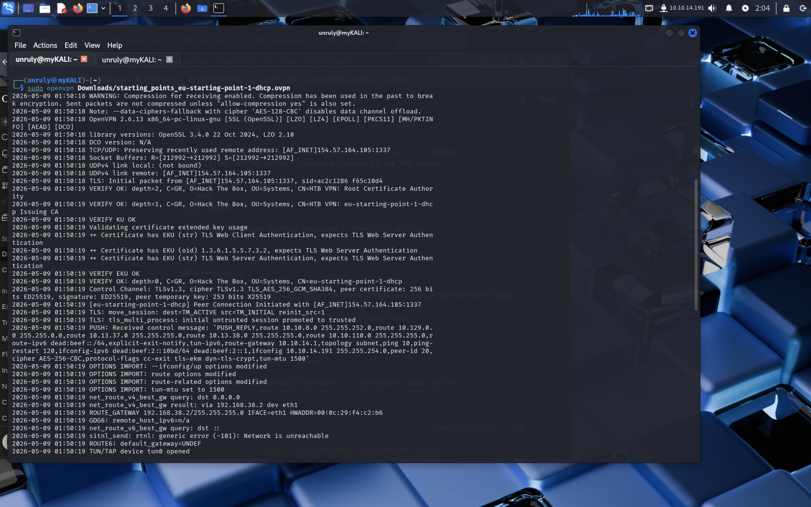
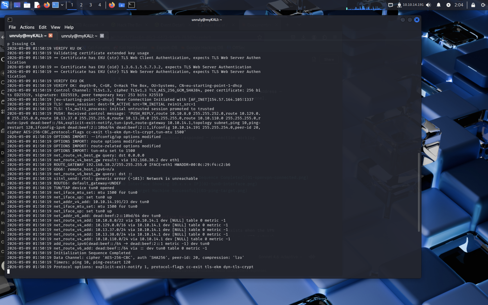
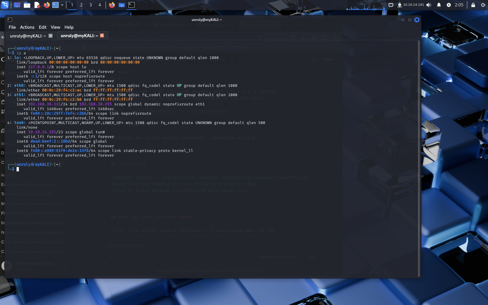
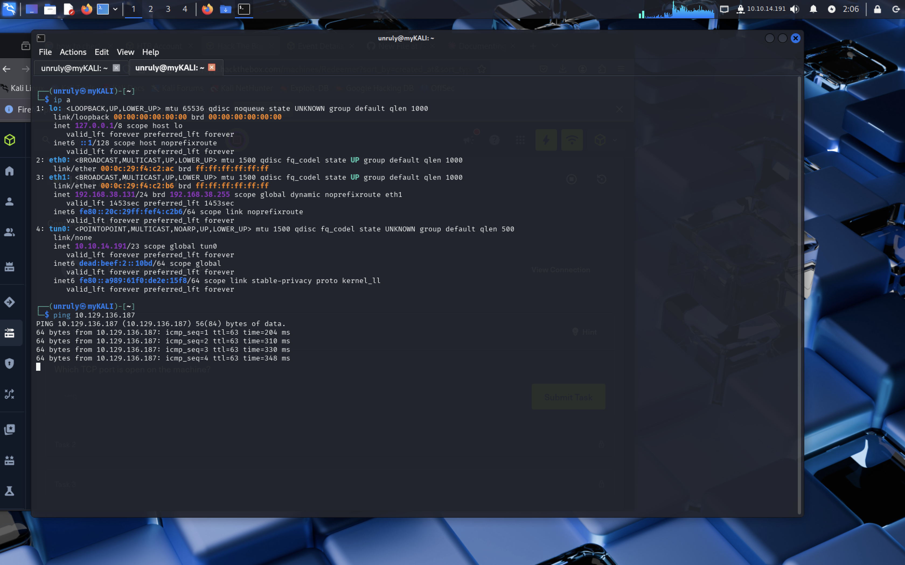
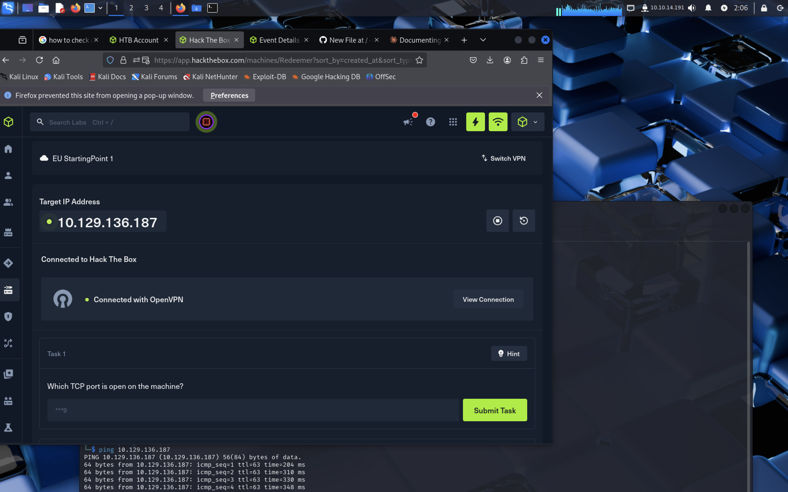

# Setup: Connecting Kali Linux to HackTheBox via OpenVPN

**Date:** 09/05/2026
**Purpose:** Connect my local Kali Linux machine to HackTheBox lab 
network as an alternative to Pwnbox, to access target machines for 
CTF and penetration testing practice.

---

## Why OpenVPN Instead of Pwnbox

Pwnbox is HackTheBox's browser-based attack machine. It requires 
HTB credits and has time limits. OpenVPN connects your own Kali 
machine directly into the HTB lab network; no credits needed, 
no time limit, and you use your own tools and configuration.

---

## What This Connection Does

OpenVPN creates an encrypted tunnel between my Kali machine and 
the HackTheBox network. Once connected, my machine gets assigned 
a 10.x.x.x IP address and can reach HTB target machines directly 
as if we are on the same local network.

---

## Steps I Followed

### 1. Downloaded the VPN Configuration File
Logged into hackthebox.com → went to Access → downloaded the 
`.ovpn` configuration file for the Starting Point Lab or Active 
machines lab (depending on which machines I was targeting).

### 2. Installed OpenVPN on Kali
```bash
sudo apt update && sudo apt install openvpn -y
```

### 3. Connected to HTB Network
```bash
sudo openvpn [filename].ovpn
```

Waited for the line `Initialization Sequence Completed` to confirm 
the tunnel was established.

### 4. Verified the Connection
Opened a new terminal and ran:
```bash
ip a
```
Confirmed a new `tun0` interface appeared with a 10.10.14.191 IP address;
this is the virtual network interface created by the VPN tunnel.

### 5. Tested Connectivity to a Target Machine
```bash
ping 10.129.136.187
```
Confirmed the target machine responded; connection working.

---

## Screenshots







---

## What the tun0 Interface Means

`tun0` is a virtual network interface — it only exists when the VPN 
tunnel is active. All traffic destined for the 10.129.136.187 HTB network 
is routed through this interface and encrypted before leaving my machine. 
This is the same pattern used when pentesters connect to a client 
environment remotely during a real engagement.

---

## Security Observations

- The `.ovpn` file contains credentials and should never be committed 
  to a public GitHub repo — it is listed in `.gitignore`
- The VPN connection is for the HTB lab network only — it does not 
  route all my internet traffic through HTB
- Running `sudo openvpn` gives the process root privileges — this is 
  required to create the `tun0` network interface
